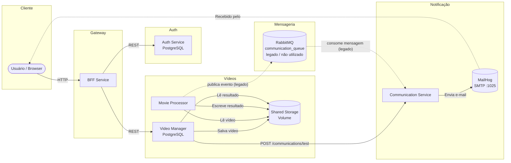

# Communication Service

Microserviço responsável pelo envio de notificações por e-mail aos usuários após o processamento de vídeos, integrante do ecossistema distribuído do **FIAP Tech Challenge — Fase 5**.

---

## Visão Geral

O **Communication Service** tem como responsabilidade única notificar os usuários sobre o resultado do processamento de seus vídeos. Ele opera de forma **síncrona via API HTTP**, recebendo requisições do **Video Manager Service** e enviando e-mails via SMTP (MailHog em ambiente local).

O serviço não gerencia estado persistente (sem banco de dados próprio), garantindo baixo acoplamento e alta resiliência.

> **Nota arquitetural:** O código contém uma implementação de consumidor RabbitMQ (`RabbitMqConsumer` / `RabbitMqConsumerHostedService`), porém essa implementação **não está ativa no fluxo atual do sistema**. O fluxo principal de execução ocorre exclusivamente via controller HTTP.

| Atributo       | Valor                                  |
|----------------|----------------------------------------|
| Runtime        | .NET 8 (ASP.NET Core)                  |
| Porta HTTP     | `8086`                                 |
| Porta HTTPS    | `9096`                                 |
| Entrada        | HTTP API (`POST /communications/test`) |
| SMTP           | MailHog (`localhost:1025` em dev)      |
| Testes         | xUnit + Moq + FluentAssertions         |

---

## Arquitetura

O serviço adota **Clean Architecture** (também referenciada como Onion Architecture), onde a dependência entre camadas flui sempre de fora para dentro — a camada mais interna (Domain) não conhece nenhuma camada externa.

### Camadas e direção de dependência

```
Communication.Api
    ↓ depende de
Communication.Application
    ↓ depende de
Communication.Domain
    ↑ implementado por
Communication.Infrastructure
```

| Camada                        | Responsabilidade                                                                                   |
|-------------------------------|----------------------------------------------------------------------------------------------------|
| **Domain**                    | Regras de negócio puras: entidades, value objects, enums, templates de e-mail, exceções de domínio |
| **Application**               | Orquestração dos casos de uso: handlers, DTOs de entrada/saída, interfaces (abstrações)            |
| **Infrastructure**            | Implementação das abstrações: consumidor RabbitMQ, cliente SMTP, configurações                     |
| **Api**                       | Ponto de entrada HTTP: controllers, contratos de request/response, mapeadores, Swagger, DI         |
| **Tests**                     | Testes unitários e de integração                                                                   |

**Princípios aplicados:**
- A camada **Domain** não referencia nenhuma outra camada do projeto.
- A camada **Application** depende apenas do **Domain** e de abstrações (`IEmailSender`).
- A camada **Infrastructure** implementa as interfaces definidas na **Application**.
- A camada **Api** injeta as dependências e expõe os endpoints REST.

---

## Estrutura de Pastas

```
tcf-fase05-communication/
├── Communication.Api/                  # Camada de apresentação (HTTP)
│   ├── Controllers/
│   │   └── CommunicationController.cs  # Endpoint manual de teste
│   ├── Contracts/
│   │   ├── Requests/                   # DTOs de entrada da API
│   │   └── Responses/                  # DTOs de saída da API
│   ├── Mappers/
│   │   └── CommunicationMapper.cs      # Conversão Request → Input
│   ├── Properties/
│   │   └── launchSettings.json
│   ├── appsettings.json                # Configurações padrão
│   ├── appsettings.Development.json    # Overrides para desenvolvimento
│   └── Program.cs                      # Bootstrap da aplicação
│
├── Communication.Application/          # Camada de aplicação (casos de uso)
│   ├── Abstractions/
│   │   ├── Clients/
│   │   │   └── IEmailSender.cs         # Contrato para envio de e-mail
│   │   ├── Messaging/                  # Contratos de mensageria (extensível)
│   │   └── Persistence/                # Contratos de persistência (extensível)
│   ├── DependencyInjection/
│   │   └── ApplicationDependencyInjection.cs
│   └── UseCases/
│       ├── Handlers/
│       │   └── SendCommunicationHandler.cs  # Orquestrador principal
│       ├── Inputs/
│       │   └── SendCommunicationInput.cs
│       └── Outputs/
│           └── SendCommunicationOutput.cs
│
├── Communication.Domain/               # Camada de domínio (regras de negócio)
│   ├── Entities/
│   │   ├── CommunicationTemplate.cs        # Classe base abstrata para templates
│   │   ├── SuccessCommunicationTemplate.cs # Template de sucesso
│   │   └── FailureCommunicationTemplate.cs # Template de falha
│   ├── Enums/
│   │   └── CommunicationTemplateType.cs    # Success | Failure
│   ├── Exceptions/
│   │   └── InvalidCommunicationException.cs
│   └── ValueObjects/
│       ├── EmailMessage.cs                 # Value object imutável do e-mail
│       └── VideoProcessingNotificationData.cs
│
├── Communication.Infrastructure/       # Camada de infraestrutura
│   ├── Clients/
│   │   └── SmtpEmailSender.cs          # Implementação de IEmailSender via SMTP
│   ├── Messaging/
│   │   ├── RabbitMqConsumer.cs             # Consumidor da fila RabbitMQ
│   │   ├── RabbitMqConsumerHostedService.cs # IHostedService que cicla o consumidor
│   │   └── VideoProcessingResultMessage.cs # DTO da mensagem consumida
│   ├── Settings/
│   │   ├── RabbitMqSettings.cs
│   │   └── SmtpSettings.cs
│   └── DependencyInjection/
│       └── InfrastructureDependencyInjection.cs
│
├── Communication.Tests/                # Testes automatizados
│   ├── Unit/
│   │   └── SendCommunicationHandlerTests.cs
│   ├── Integration/                    # Estrutura preparada para expansão
│   └── Fixtures/
│
├── Communication.sln
├── Dockerfile
└── README.md
```

---

## Responsabilidades do Serviço

1. **Receber requisições HTTP** via `POST /communications/test` originadas pelo Video Manager Service.
2. **Selecionar o template** de e-mail adequado com base no resultado do processamento (`Success` ou `Failure`).
3. **Construir o corpo do e-mail** utilizando o template de domínio correspondente.
4. **Enviar o e-mail** via SMTP para o endereço do usuário informado na requisição.
5. **Retornar confirmação** ao chamador com o resultado do envio (`sent: true/false`).

> **Implementação legada (não utilizada no fluxo atual):** O serviço contém código para consumir mensagens da fila `communication_queue` no RabbitMQ (`RabbitMqConsumer`, `RabbitMqConsumerHostedService`), incluindo ACK manual após processamento. Essa implementação está presente no código, porém **não utilizada no fluxo atual do sistema**.

---

## Integração com Outros Serviços



### Posição no ecossistema

| Serviço              | Interação com Communication Service                                                              |
|----------------------|--------------------------------------------------------------------------------------------------|
| **Video Manager Service** | Chama `POST /communications/test` via HTTP após receber a notificação de conclusão do processamento (fluxo principal) |
| **BFF Service**      | Interage com o Video Manager Service; não aciona o Communication Service diretamente                |
| **MailHog**          | Servidor SMTP local que recebe e exibe os e-mails enviados                                       |
| **RabbitMQ**         | Broker presente na infraestrutura; consumidor implementado no código, porém **não utilizado no fluxo atual** |
| **Movie Processor**  | Publicava mensagem em `communication_queue`; integração **legada**, não ativa no fluxo atual    |

---

## Fluxo de Requisições

### Fluxo HTTP (principal)

```
Video Manager Service
    → HTTP POST /communications/test  { email, fileName, status }
        → CommunicationController
            → CommunicationMapper.ToInput() → SendCommunicationInput
                → SendCommunicationHandler.HandleAsync()
                    → seleciona SuccessCommunicationTemplate ou FailureCommunicationTemplate
                        → template.BuildBody(fileName)
                            → cria EmailMessage (value object)
                                → IEmailSender.SendAsync(EmailMessage)
                                    → SmtpEmailSender → MailHog (SMTP)
                                        → 200 OK { sent: true, message: "Email sent" }
```

### Fluxo via mensageria (legado — implementação presente no código, porém não utilizada no fluxo atual)

```
Movie Processor
    → publica VideoProcessingResultMessage em communication_queue (RabbitMQ)
        → RabbitMqConsumerHostedService (IHostedService)  [INATIVO]
            → RabbitMqConsumer.OnMessageReceivedAsync()
                → deserializa VideoProcessingResultMessage
                    → SendCommunicationHandler.HandleAsync(SendCommunicationInput)
                        → (mesmo fluxo de template e envio acima)
                            → BasicAckAsync (confirma mensagem)
```

---

## Comunicação Assíncrona

> **Atenção:** A implementação de mensageria descrita nesta seção está **presente no código, porém não utilizada no fluxo atual do sistema**. O fluxo ativo é exclusivamente via HTTP API (ver seção [Fluxo de Requisições](#fluxo-de-requisições)).

### Consumo de mensagens (legado — não ativo)

O código contém uma implementação para **consumir** mensagens da fila `communication_queue`. Não publica eventos. Essa implementação não está ativada no fluxo atual.

| Atributo       | Valor                      |
|----------------|----------------------------|
| Broker         | RabbitMQ                   |
| Fila           | `communication_queue`      |
| Durable        | `true`                     |
| Auto-delete    | `false`                    |
| Auto-ack       | `false` (ACK manual)       |
| Binding        | Direto (sem exchange)      |

### Formato da mensagem (legado)

```json
{
  "Email": "usuario@exemplo.com",
  "FileName": "video-do-usuario.mp4",
  "Success": true
}
```

| Campo      | Tipo    | Descrição                                            |
|------------|---------|------------------------------------------------------|
| `Email`    | string  | Endereço de e-mail do destinatário                   |
| `FileName` | string  | Nome do arquivo de vídeo processado                  |
| `Success`  | boolean | `true` = processamento bem-sucedido / `false` = falha|

### Templates de e-mail gerados

**Sucesso (`Success = true`)**
- **Assunto:** `Processamento concluído: seu vídeo está disponível`
- **Corpo:** Informa que o arquivo foi processado com sucesso e o resultado está disponível para download.

**Falha (`Success = false`)**
- **Assunto:** `Falha no processamento do seu vídeo`
- **Corpo:** Informa que o processamento falhou e solicita nova tentativa ou contato com o suporte.

---

## Endpoints

### REST API

| Método | Endpoint                | Descrição                                              | Autenticação |
|--------|-------------------------|--------------------------------------------------------|--------------|
| `POST` | `/communications/test`  | Dispara manualmente o envio de e-mail para teste       | Não          |
| `GET`  | `/health`               | Health check da aplicação                              | Não          |
| `GET`  | `/swagger`              | Interface Swagger UI com documentação dos endpoints    | Não          |

### Request — `POST /communications/test`

```json
{
  "email": "usuario@exemplo.com",
  "fileName": "meu-video.mp4",
  "status": "Finished"
}
```

> O campo `status` deve ser `"Finished"` para acionar o template de sucesso. Qualquer outro valor aciona o template de falha.

### Response — `200 OK`

```json
{
  "sent": true,
  "message": "Email sent"
}
```

---

## Dependências de Infraestrutura

| Dependência  | Finalidade                                  | Porta padrão                     |
|--------------|---------------------------------------------|----------------------------------|
| **RabbitMQ** | Broker de mensagens assíncronas             | `5672`                           |
| **MailHog**  | Servidor SMTP para testes locais            | `1025` (SMTP) / `8025` (UI Web)  |

> Este serviço **não utiliza banco de dados**. Todo o estado é efêmero — a mensagem é consumida, o e-mail é enviado e a operação é concluída.

### Configuração via `appsettings.json`

```json
{
  "RabbitMq": {
    "HostName": "localhost",
    "Port": 5672,
    "UserName": "guest",
    "Password": "guest",
    "QueueName": "communication_queue"
  },
  "Smtp": {
    "Host": "localhost",
    "Port": 1025,
    "User": "",
    "Password": "",
    "From": "no-reply@communication.local",
    "EnableSsl": false
  }
}
```

---

## Executando Localmente

### Pré-requisitos

- [.NET 8 SDK](https://dotnet.microsoft.com/download/dotnet/8.0)
- [Docker](https://www.docker.com/) (para RabbitMQ e MailHog)

### 1. Subir infraestrutura local

```bash
# RabbitMQ
docker run -d --name rabbitmq -p 5672:5672 -p 15672:15672 rabbitmq:3-management

# MailHog
docker run -d --name mailhog -p 1025:1025 -p 8025:8025 mailhog/mailhog
```

### 2. Restaurar dependências e executar

```bash
dotnet restore
dotnet run --project Communication.Api
```

A API estará disponível em:
- Swagger UI: `http://localhost:8086/swagger`
- Health Check: `http://localhost:8086/health`

### 3. Verificar e-mails enviados

Acesse a interface do MailHog em `http://localhost:8025` para visualizar os e-mails recebidos.

### Variáveis de ambiente (Docker / produção)

| Variável              | Descrição                                       |
|-----------------------|-------------------------------------------------|
| `RabbitMq__HostName`  | Host do RabbitMQ                                |
| `RabbitMq__Port`      | Porta do RabbitMQ (padrão: `5672`)              |
| `RabbitMq__UserName`  | Usuário do RabbitMQ                             |
| `RabbitMq__Password`  | Senha do RabbitMQ                               |
| `RabbitMq__QueueName` | Nome da fila (padrão: `communication_queue`)    |
| `Smtp__Host`          | Host do servidor SMTP                           |
| `Smtp__Port`          | Porta SMTP (padrão: `1025`)                     |
| `Smtp__From`          | Endereço remetente dos e-mails                  |

---

## Deploy

### Build da imagem Docker

```bash
docker build -t communication-service .
```

### Executar o container

```bash
docker run -d \
  -p 8086:8086 \
  -e RabbitMq__HostName=rabbitmq \
  -e RabbitMq__UserName=guest \
  -e RabbitMq__Password=guest \
  -e RabbitMq__QueueName=communication_queue \
  -e Smtp__Host=mailhog \
  -e Smtp__Port=1025 \
  -e Smtp__From=no-reply@communication.local \
  --name communication-service \
  communication-service
```

### Dockerfile (resumo)

O Dockerfile utiliza **multi-stage build**:

1. **`build`** — Compila o projeto com `dotnet build` usando a imagem `mcr.microsoft.com/dotnet/sdk:8.0-alpine`.
2. **`publish`** — Publica o artefato otimizado com `dotnet publish`.
3. **`final`** — Imagem de runtime enxuta (`mcr.microsoft.com/dotnet/aspnet:8.0-alpine`) com usuário não-root (`fiap`) por segurança.

---

## Testes

O projeto de testes utiliza **xUnit**, **Moq** e **FluentAssertions**.

### Executar os testes

```bash
dotnet test
```

### Executar com cobertura de código

```bash
dotnet test --collect:"XPlat Code Coverage"
```

### Casos de teste implementados (`SendCommunicationHandlerTests`)

| Cenário                       | Resultado esperado                    |
|-------------------------------|---------------------------------------|
| Input com `Success = true`    | E-mail enviado, `Sent = true`         |
| Input com `Success = false`   | E-mail enviado, `Sent = true`         |
| Input `null`                  | Lança `InvalidCommunicationException` |

### Estrutura de testes

```
Communication.Tests/
├── Unit/
│   └── SendCommunicationHandlerTests.cs   # Testes do handler principal
├── Integration/                            # Estrutura preparada para testes de integração
└── Fixtures/                               # Fixtures compartilhadas entre testes
```

---

## Workflow de Branches

O repositório segue o modelo **Git Flow**:

| Branch | Finalidade |
|---|---|
| `main` | Código de produção. Código protegido — merge apenas via Pull Request aprovado. |
| `develop` | Branch de desenvolvimento contínuo. Base para features. |
| `release/*` | Preparação de releases (`release/v1.0.0`). |
| `feature/*` | Desenvolvimento de novas funcionalidades (não monitorada pelo CI diretamente). |

O pipeline de CI é acionado em Pull Requests e pushes para `main`, `develop` e `release/*`. A publicação da imagem Docker ocorre apenas em pushes diretos para `main` e `develop`.
